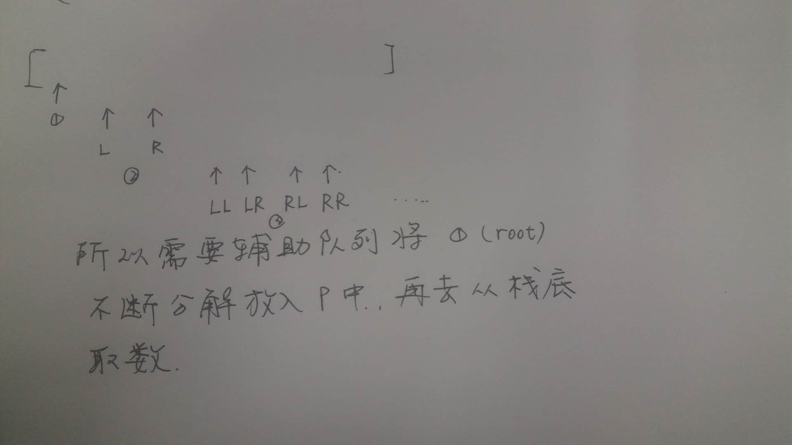

给定一个二叉树，检查它是否镜像对称。

例如：
 [1, 2, 2, 3, 4, 4, 3, 5, 6, 7, 8, 8, 7, 6, 5] 是对称的

``` bash
         1
      /     \
    2        2
   / \       /  \
  3    4    4    3
 / \  / \  / \  / \
5  6 7  8  8  7 6  5
```
但是下面这个 [1,2,2,null,3,null,3] 则不是镜像对称的:

``` bash
    1
   / \
  2   2
   \   \
   3    3
```

`**bfs先建立该树。**`
``` js
const a = [1, 2, 2, 3, 4, 4, 3];
const build = a => {
	const ListNode = class {
		constructor (val) {
			this.val = val;
			this.left = this.right = null;
		}
	};
	let i = 0;
	const root = new ListNode(a[i]);
	const p = [];

	const proc = n => {
		if (!n) return;
		const [l, r] = [++i, ++i];
		if (a[l]) {
			const node = new ListNode(a[l]);
			p.push(node);
			n.left = node;
		}
		if (a[r]) {
			const node = new ListNode(a[r]);
			p.push(node);
			n.right = node;
		}
		proc(p.shift());
	};
	proc(root);
	return root;
};
build(a);
```

1. 感觉递归不好回溯，要用循环写。
2. 确实没反应过来, 思路是`镜像二叉树的 左本右 === 右本左`
	- 所以这道题的解法有两种，一种是把 左本右和右本左 遍历后的数组 做对比。
	- 第二种方法是递归对比，即 `左子节点的左子节点的值 === 右子节点的右子节点的值， 左子节点的右子节点的值 === 右子节点的右子节点的值`
3. 还需要注意的是既然是先序遍历，左右如果有一个值为null的时候，无法确定顺序。
比如：
``` bash
    2     2
   / \   / \
      4     4
```
如果不把null算进去，本左右的值是 `[2, 4] 和 [2, 4]`，但其实他俩不对称。


`第一遍写： `
：

``` js
check = root => {
	if (!root) return true;
	const [l, r] = [[], []];
	const lDfs = n => {
		l.push(n && n.val);
		if (!n) return;
		lDfs(n.left);
		lDfs(n.right);
	}
	const rDfs = n => {
		r.push(n && n.val);
		if (!n) return;
		rDfs(n.right);
		rDfs(n.left);
	};

	lDfs(root);
	rDfs(root);

	if (l.length !== r.length) return false;
    for (let i = 0; i < l.length; i++) {
        if (l[i] !== r[i]) return false;
    }
    return true;
};
check(root);
```

`结构不好： ` 没必要新开俩数组。

优化的解：
``` js
const same = (a, b) => {
	if (a === null && b === null) return true;
	if ((a && a.val) !== (b && b.val)) return false;
	return same(a.left, b.right) && same(a.right, b.left);
}
return same(root.left, root.right);
```


